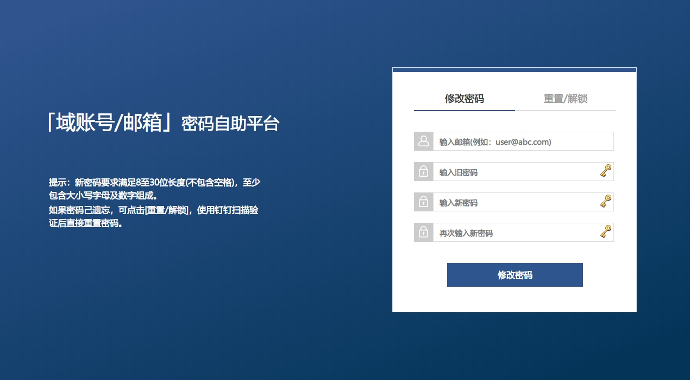
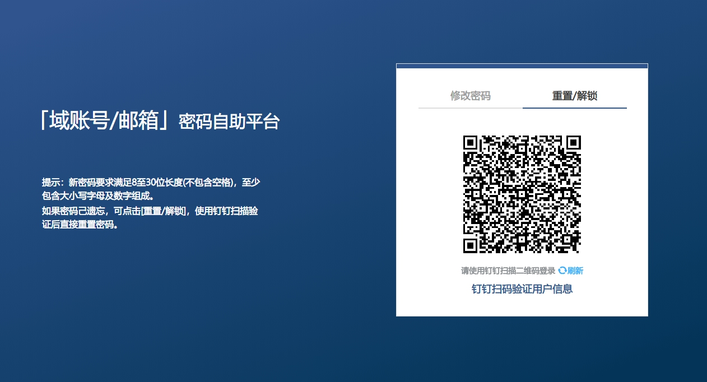

# 初学Django时碰到的一个需求，因为公司中很多员工在修改密码之后，有一些关联的客户端或网页中的旧密码没有更新，导致密码在尝试多次之后账号被锁，为了减少这种让人头疼的重置解锁密码的操蛋工作，自己做了一个自助修改小平台。

## 代码写得很LOW，有需要的可以直接拿去用。

## 截图




## 需要的基础环境：
+ Python 3.6.x
* Nginx(建议)
* Uwsgi(建议)

## 钉钉必要条件：
#### E应用配置
* 在钉钉工作台中通过“自建应用”创建应用，选择“企业内部自主开发”，在应用首页中获取应用的AgentId、AppKey、AppSecret。
* 应用需要权限：身份验证、消息通知、通讯录只读权限、手机号码信息、邮箱等个人信息、智能人事，范围是全部员工或自行选择
* 应用安全域名和IP一定要配置，否则无法返回接口数据。

#### 移动接入应用：
* 登录中开启扫码登录，配置回调域名：“https://pwd.abc.com/resetcheck”
  其中pwd.abc.com请按自己实际域名来，并记录相关的appId、appSecret。


## 按自己实际的配置修改项目配置参数：
修改pwdselfservice/local_settings.py中的参数，按自己的实际参数修改

```` python
# AD配置
AD_HOST = 'abc.com'
AD_LOGIN_USER = 'abc\pwdadmin'
AD_LOGIN_USER_PWD = 'gVykWgNNF0oBQzwmwPp8'
BASE_DN = 'OU=rd,DC=abc,DC=com'

# 钉钉配置
# 钉钉统一接口地址，不可修改
DING_URL = "https://oapi.dingtalk.com/sns"

# 钉钉企业ID
DING_CORP_ID = 'ding01769028f06d321'

# 钉钉E应用
DING_AGENT_ID = '25304321'
DING_APP_KEY = 'dingqdzmn611l5321321'
DING_APP_SECRET = 'rnGRJhhw5kVmzykG9mrTDxewmI4e0myP1123333221jzeKv3amQYWcInLV3x'

# 钉钉移动应用接入
DING_SELF_APP_ID = 'dingoabr112233xts'
DING_SELF_APP_SECRET = 'IrH2MedSgesguFjGvFCTjXYBRZD3322112233332211222

# Crypty key 通过Crypty.generate_key生成
CRYPTO_KEY = b'dp8U9y7NAhCD3MoNwPzPBhBtTZ1uI_WWSdpNs6wUDgs='

# COOKIE 超时
TMPID_COOKIE_AGE = 300

# 主页域名
HOME_URL = 'https://pwd.abc.com'

````


### 自行安装完python3之后，使用python3目录下的pip3进行安装依赖：
### 我自行安装的Python路径为/usr/local/python3

项目目录下的requestment文件里记录了所依赖的相关python模块，安装方法：
* /usr/local/python3/bin/pip3 install -r requestment

等待所有模块安装完成之后进行下一步。

安装完依赖后，直接执行
/usr/local/python3/bin/python3 manager.py runserver x.x.x.x:8000
即可访问正常访问项目

## 通过uwsgi启动：
/usr/local/python3/bin/uwsgi -d --ini /usr/loca/wwwroot/pwdselfservice/uwsgi.ini

其中/xxx/xxx/pwdselfservice/uwsgi.ini是你自己的服务器中此文件的真实地址

启动之后也可以通过IP+端口访问了。

提供2个脚本，让uwsgi在修改文件时能自动重载：

uwsgi-start.sh:
```shell
#!/bin/sh
/usr/local/python3/bin/uwsgi -d --ini /usr/loca/wwwroot/pwdselfservice/uwsgi.ini --touch-reload "/usr/loca/wwwroot/pwdselfservice/reload.set"
```

uwsgi-autoreload.sh:
````shell
#!/bin/sh
objectdir="/usr/loca/wwwroot/pwdselfservice"

/usr/bin/inotifywait -mrq --exclude "(logs|\.swp|\.swx|\.log|\.pyc|\.sqlite3)" --timefmt '%d/%m/%y %H:%M' --format '%T %wf' --event modify,delete,move,create,attrib ${objectdir} | while read files
do
/bin/touch /usr/loca/wwwroot/pwdselfservice/reload.set
continue
done & 
````


脚本内的路径按自己实际情况修改

## Nginx配置：

Nginx Server配置：
* proxy_pass的IP地址改成自己的服务器IP
* 配置可自己写一个vhost或直接加在nginx.conf中
```` nginx
server {
    listen  80;
    server_name pwd.abc.com;

    location / {
        proxy_pass         http://192.168.x.x:8000;
        proxy_set_header   Host              $host;
        proxy_set_header   X-Real-IP         $remote_addr;
        proxy_set_header   X-Forwarded-For   $proxy_add_x_forwarded_for;

    }
	access_log  /var/log/nginx/vhost/pwd.log access;
	error_log   /var/log/nginx/vhost/pwd.err error;
}
````

- 执行Nginx reload操作，重新加载配置